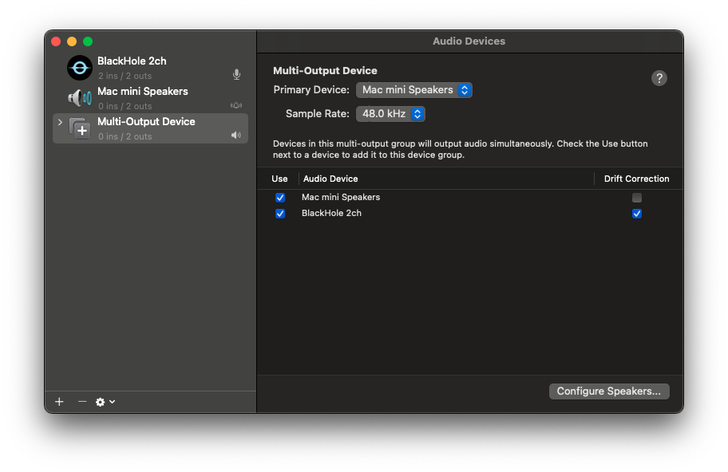

# Meeting Copilot

<video src="assets/demo.mov" controls width="100%"></video>

A real-time AI meeting assistant that listens to your system audio, transcribes speech using Whisper, and streams AI-generated answers and follow-up questions to your terminal — with optional document context via RAG.

---

## How It Works

```
System Audio (BlackHole)
    → sounddevice InputStream
    → Voice Activity Detection (Silero VAD)
    → Speech Transcription (faster-whisper)
    → Debounce / Flush Buffer
    → LLM Suggestion (GPT-4o or Claude)
    → Terminal Output (streamed)
```

The assistant detects when someone finishes speaking, transcribes the utterance, optionally retrieves relevant context from your documents, and streams a suggested answer + follow-up question directly to your terminal.

---

## Prerequisites

### System Requirements

- **MacOS**
- **Python 3.11+**
- **[uv](https://github.com/astral-sh/uv)** — fast Python package manager (recommended)
- **[BlackHole 2ch](https://existential.audio/blackhole/)** — virtual audio device that routes system audio to the app

### BlackHole Setup

BlackHole 2ch must be installed and configured as a Multi-Output Device so your speakers and BlackHole both receive audio simultaneously:

1. Install BlackHole 2ch from [existential.audio/blackhole](https://existential.audio/blackhole/)
2. Open **Audio MIDI Setup** (Search using spotlight `CMD + Space`)
3. Click **+** at the bottom left → **Create Multi-Output Device**
4. Check both **BlackHole 2ch** and your speakers/headphones
5. Enable **Drift Correction** on BlackHole 2ch to keep audio in sync
6. Go to **System Settings → Sound → Output** and select the **Multi-Output Device**



> The screenshot above shows the correct configuration: a Multi-Output Device with both **Mac mini Speakers** and **BlackHole 2ch** checked, with Drift Correction enabled on BlackHole.

### API Keys

| Key                 | Required                 | Purpose                                            |
| ------------------- | ------------------------ | -------------------------------------------------- |
| `OPENAI_API_KEY`    | Always                   | GPT-4o suggestions + embeddings                    |
| `ANTHROPIC_API_KEY` | If `LLM_PROVIDER=claude` | Claude suggestions                                 |
| `COHERE_API_KEY`    | Optional                 | Reranking in RAG mode (improves retrieval quality) |

---

## Installation

```bash
# Clone the repo
git clone <repo-url>
cd audio-transcriber

# Install dependencies with uv (recommended)
uv sync

# Or with pip
pip install faster-whisper sounddevice numpy openai anthropic torch torchaudio \
    tiktoken qdrant-client pypdf2 python-docx python-dotenv rank-bm25 cohere
```

---

## Configuration

Copy `.env.example` as `.env` file in the project root:

`cp .env.example .env`

```env
# Required
OPENAI_API_KEY=sk-...

# Optional — only needed if using Claude
ANTHROPIC_API_KEY=sk-ant-...
LLM_PROVIDER=openai          # "openai" (default) or "claude"

# Optional — enables Cohere reranking in RAG mode
COHERE_API_KEY=...
```

All settings can also be passed as shell environment variables. The `.env` file takes precedence over shell env vars.

### Full Configuration Reference

| Variable                       | Default                  | Description                                                              |
| ------------------------------ | ------------------------ | ------------------------------------------------------------------------ |
| `LLM_PROVIDER`                 | `openai`                 | LLM backend: `openai` (GPT-4o) or `claude` (claude-sonnet-4-6)           |
| `MODEL_SIZE`                   | `base`                   | Whisper model size: `tiny`, `base`, `small`, `medium`, `large-v2`        |
| `SILENCE_THRESHOLD`            | `4.0`                    | Seconds of silence after speech before an utterance is committed         |
| `FLUSH_WAIT_SECONDS`           | `4.0`                    | Seconds after last transcript segment before calling the LLM             |
| `SPEECH_PROBABILITY_THRESHOLD` | `0.2`                    | VAD sensitivity (0–1). Lower = catches more speech; raise in noisy rooms |
| `MIN_UTTERANCE_SECONDS`        | `1.0`                    | Utterances shorter than this are discarded                               |
| `MODE`                         | `auto`                   | Default mode: `auto` (VAD-triggered) or `manual` (Enter-triggered)       |
| `SAMPLE_RATE`                  | `16000`                  | Audio sample rate in Hz (do not change — Whisper's native rate)          |
| `VAD_CHUNK_SIZE`               | `512`                    | Silero VAD chunk size in samples (do not change)                         |
| `EMBEDDER_TOKEN_THRESHOLD`     | `4000`                   | Token count above which RAG mode activates instead of full-context       |
| `EMBEDDER_TARGET_CHUNK_TOKENS` | `400`                    | Target tokens per chunk in RAG mode                                      |
| `EMBEDDER_OVERLAP_TOKENS`      | `50`                     | Token overlap between chunks                                             |
| `EMBEDDER_EMBED_MODEL`         | `text-embedding-3-small` | OpenAI embedding model                                                   |
| `EMBEDDER_EMBED_DIM`           | `1536`                   | Embedding vector dimensions (must match embed model)                     |
| `BLACKHOLE_DEVICE_INDEX`       | `1`                      | Fallback device index if BlackHole auto-detection fails                  |

---

## Running

### Basic — No Context

```bash
uv run copilot
```

### With Context Files

Pass one or more context files as arguments. Supported formats: `.txt`, `.pdf`, `.docx`.

```bash
# Single file
uv run copilot context.txt

# Multiple files
uv run copilot meeting_notes.txt product_spec.pdf company_overview.docx
```

When context is provided, the app automatically selects a retrieval strategy:

- **Full-context mode** — if total tokens < 4000, the entire document is passed directly to the LLM
- **RAG mode** — if total tokens ≥ 4000, documents are chunked, embedded, and retrieved via hybrid search (vector + BM25, optionally reranked by Cohere)

---

## Runtime Controls

Once running, control the assistant with keyboard commands:

| Key + Enter | Action                                                               |
| ----------- | -------------------------------------------------------------------- |
| `m`         | Toggle between **auto** and **manual** mode                          |
| `q`         | Quit the session, view chat history, and optionally export as `.txt` |

### Auto Mode (default)

The VAD detects end-of-utterance automatically. When silence exceeds `SILENCE_THRESHOLD` seconds, the accumulated audio is transcribed and sent to the LLM.

### Manual Mode

Audio accumulates continuously. Press **Enter** to trigger transcription and get a suggestion. Useful in noisy environments or when you want precise control over when the AI responds.

---

## AI Output Format

Every LLM response is streamed to the terminal in this format:

```
ANSWER: <suggested answer to the question>
FOLLOW-UP: <suggested follow-up question>
```

The response streams token-by-token as it is generated.

---

## Noise / Greeting Suppression

Short social phrases ("hi", "thanks", "ok", "got it") are detected and silently dropped — the LLM is not called for these. This filter is bypassed in manual mode.

To suppress additional patterns, extend `DEFAULT_GREETINGS` in [`src/assistant/greeting_filter.py`](src/assistant/greeting_filter.py).

---

## Session Chat History

Every utterance and AI response is recorded for the duration of your session. When you quit with `q`, you can review the history in the terminal and optionally export it as a `.txt` file.

---

## Project Structure

```
src/
├── copilot.py                   # Entry point — wires all components together
├── config.py                    # AppConfig — reads env vars with typed defaults
│
├── audio/
│   ├── pipeline.py              # Orchestrates the full runtime loop
│   ├── audio_capture.py         # Opens the sounddevice InputStream
│   ├── audio_device.py          # Finds the BlackHole device index
│   ├── vad.py                   # Silero VAD wrapper
│   ├── speech_transcriber.py    # faster-whisper wrapper
│   └── flush_buffer.py          # Debounces transcript segments before AI call
│
├── assistant/
│   ├── suggestion_generator.py  # Builds prompt, calls LLM, prints output
│   ├── greeting_filter.py       # Skips filler phrases ("hi", "ok", etc.)
│   └── conversation_history.py  # Rolling window of recent utterances
│
├── llm/
│   ├── base.py                  # BaseLLMService — abstract interface
│   ├── factory.py               # Reads LLM_PROVIDER, returns the right service
│   ├── openai_service.py        # GPT-4o via OpenAI API
│   └── claude_service.py        # Claude via Anthropic API
│
├── rag/
│   ├── context_reader.py        # Loads .txt / .pdf / .docx files
│   ├── retriever_builder.py     # Decides full-context vs RAG, builds retriever
│   ├── retriever.py             # FullContextRetriever and HybridRetriever
│   ├── embedding_service.py     # OpenAI embeddings
│   ├── vector_store.py          # In-memory Qdrant collection
│   └── text_chunker.py          # Splits docs into overlapping chunks
│
└── chat_history/
    └── chat_history_service.py  # Records session exchanges, exports TXT
```

---

## Troubleshooting

**BlackHole device not found**
Set `BLACKHOLE_DEVICE_INDEX` to the correct sounddevice index. Run `python -c "import sounddevice; print(sounddevice.query_devices())"` to list all devices.

**Poor transcription quality**
Try a larger Whisper model: `MODEL_SIZE=small` or `MODEL_SIZE=medium`. Note that larger models are slower to load and run.

**AI triggers too often / on noise**
Raise `SPEECH_PROBABILITY_THRESHOLD` (e.g. `0.5`) or increase `MIN_UTTERANCE_SECONDS` (e.g. `2.0`).

**AI triggers too slowly**
Lower `SILENCE_THRESHOLD` and `FLUSH_WAIT_SECONDS` (e.g. `2.0` each).

**Embeddings not working**
Ensure `OPENAI_API_KEY` is set — embeddings always use OpenAI regardless of `LLM_PROVIDER`.
